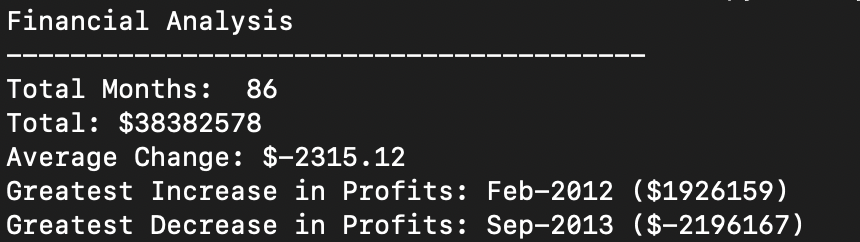
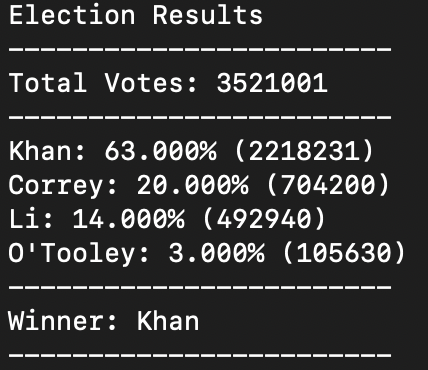

## Summary
Utilize Python to create analysis on financial data ([budget_data.csv]( https://github.com/carmelamonis/python-challenge/blob/main/data/budget_data.csv)) and poll data. Each dataset is a csv that is imported for calculation and analysis.

## Scope
### Budget Data
The budget data consist of monthly profit/losses from January 2010 to February 2017. I used Python to create a script to calculate and print out a summary that consists that following:
 - Total Number of months included in the dataset
 - The net total amount of "Profit/Losses" over the entire period
 - Calculate the changes in "Profit/Losses" over the entire period, then find the average of those changes
 - The greatest increase in profits (date and amount) over the entire period
 - The greatest decrease in losses (date and amount) over the entire period

### Poll Data
The poll data has over a million rows of data that holds the Voter ID, the voter’s County and the candidate they voted for. I used Python to create a script to calculate and analyze the millions of votes in the dataset. The results are then printed out with the following information:
 - The total number of votes cast
 - A complete list of candidates who received votes
 - The percentage of votes each candidate won
 - The total number of votes each candidate won
 - The winner of the election based on popular vote.
 

#### Note: 
Due to the size of the dataset, the poll data can be found using this [Google Drive Link](https://drive.google.com/file/d/1DncbQd16Gm0xsACC0p86QFZB_yX1Ywqe/view?usp=sharing)
